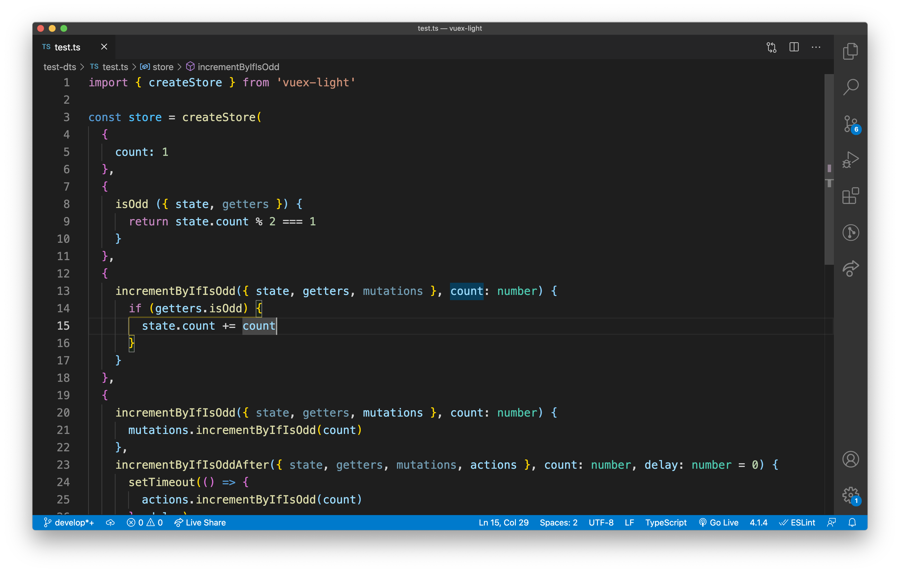
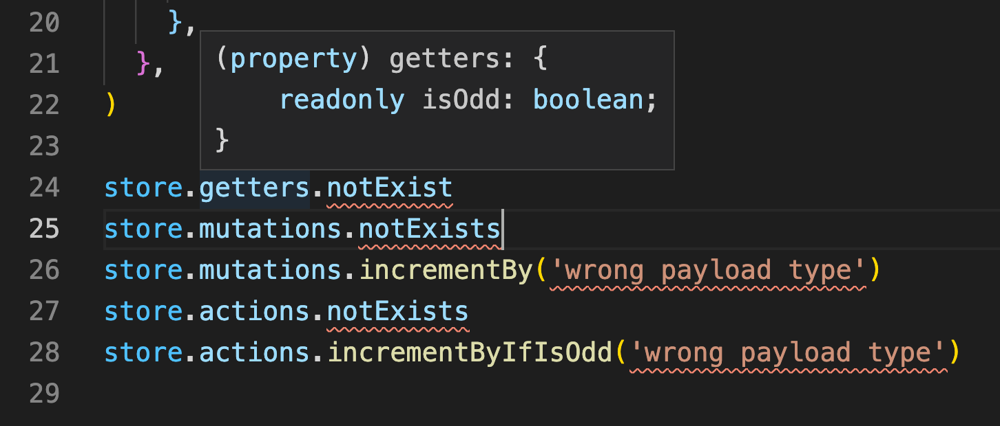

# vuex-light

[](https://www.npmjs.com/package/vuex-light)
[](https://bundlephobia.com/result?p=vuex-light@latest)
[](https://github.com/iendeavor/vuex-light/actions?query=workflow%3ACI+branch%3Amain+)


<p align="center">
  <a href="http://www.youtube.com/watch?v=bXR1VQWUd20" target="_blank">
    
  </a>
</p>

# Why

Have you ever want to know "what type payload is" or "what getters the store have" when use the vuex?

In _vuex-light_, you have better typing to create and use store:

<p align="center">
  
</p>

# Features

- Robust typescript support :muscle:
  > See [e2e test](https://github.com/iendeavor/vuex-light/blob/main/test-dts/e2e.spec.ts).
- Consistent and intuitive interface :bulb:
  > See [GettersOption](https://iendeavor.github.io/vuex-light/vuex-light.gettersoptiontype.html),
  > [MutationsOption](https://iendeavor.github.io/vuex-light/vuex-light.mutationsoptiontype.html),
  > [ActionsOption](https://iendeavor.github.io/vuex-light/vuex-light.actionsoptiontype.html) typing.
- Implement with vue 3 reactivity system only
- Light weight

# Installation

via npm

```
yarn add vuex-light
```

via cdn

```html
<script src="https://unpkg.com/vuex-light@latest"></script>
```

# Getting Started

Create the simplest store:

```ts
// store.ts
import { createStore } from 'vuex-light'

// Create a new store instance.
export const store = createStore(
  // state
  {
    count: 0,
  },
  // getters
  {},
  // mutations
  {
    increment({ state }) {
      state.count++
    },
  },
)
```

Now, your can access the store by the following ways:

1. [globalProperty](https://v3.vuejs.org/api/application-config.html#globalproperties)

   ```ts
   // main.ts
   // Adds the $store property that can be accessed in any component instance inside the application.
   app.config.globalProperties.$store = store

   app.component('child-component', {
     mounted() {
       console.log(this.$store.state.count)
     },
   })
   ```

   Example: [Hello world](https://codesandbox.io/s/github/iendeavor/vuex-light/tree/main/examples/hello-world)

2. [provide/inject](https://v3.vuejs.org/api/application-api.html#provide)

   ```ts
   // main.ts
   import { createApp } from 'vue'
   import { store } from './store'

   const app = createApp({
     inject: ['store'],
     template: `
       <div>
         {{ store.state.count }}
       </div>
     `,
   })

   // Sets the store that can be injected into all components within the application.
   app.provide('store', store)
   ```

   Example: [Counter](https://codesandbox.io/s/github/iendeavor/vuex-light/tree/main/examples/counter)

3. useStore

   ```ts
   // store.ts
   // create the `useStore` composition function
   export function useStore() {
     return store
   }
   ```

   ```ts
   // in a vue component
   import { defineComponent } from 'vue'
   import { useStore } from './store'

   export default defineComponent({
     setup() {
       const { state, mutations } = useStore()

       return {
         state,
         mutations,
       }
     },
   })
   ```

   Example: [Todo MVC](https://codesandbox.io/s/github/iendeavor/vuex-light/tree/main/examples/todomvc-vite)

# Core API

```ts
const store = createStore(
  // state
  {
    count: 0,
  },
  // getters
  {
    isOdd({ state, getters }) {
      // ...
    },
  },
  // mutations
  {
    increment({ state, getters, mutations }, ...payloads) {
      // ...
    },
  },
  // actions
  {
    incrementIfOdd({ state, getters, mutations, actions }, ...payloads) {
      // ...
    },
  },
  // modules
  {
    module: createStore({
      moduleCount: 0,
    }),
  },
)

store.state.count
store.getters.isOdd
store.mutations.increment()
store.actions.incrementIfOdd()
store.modules.module.state.moduleCount
```

# Plugins

## `createLoggerPlugin`

https://iendeavor.github.io/vuex-light/vuex-light.createloggerplugin.html

## `createPersistPlugin`

https://iendeavor.github.io/vuex-light/vuex-light.createpersistplugin.html

# Contributing

Please read [CONTRIBUTING.md](/CONTRIBUTING.md) for details on our code of conduct, and the process for submitting pull
requests to us.

# Versioning

We use [SemVer](https://semver.org/) for versioning. For the versions available, see the tags on this repository.

# License

This project is licensed under the MIT License - see the [LICENSE](/LICENSE) file for details
